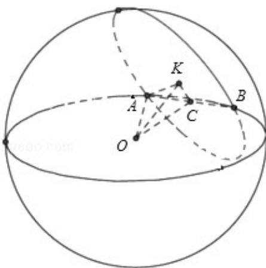

> [!faq]- 2013年全国统一高考数学试卷（文科）（大纲版）（含解析版）解析
>
> > [!success]- **【答案】** $16\pi$
>
> > [!note]- **【分析】**
> > 正确作出图形，利用勾股定理，建立方程，即可求得结论.
>
> > [!note]- **【解析】**
> > 解：如图所示，设球O的半径为r，AB是公共弦， $\angle OCK$ 是面面角根据题意得 $OC = \frac{\sqrt{3}}{2} r, CK = \frac{\sqrt{3}}{4} r$ 在 $\triangle OCK$ 中， $OC^2 = OK^2 + CK^2$ ，即 $\frac{3}{4} r^2 = \frac{9}{4} + \frac{3}{16} r^2$
> >
> > $$
> > \therefore r ^ {2} = 4
> > $$
> >
> > ∴球 O 的表面积等于 $4\pi r^{2}=16\pi$
> >
> > 故答案为 $16\pi$
> >
> > 
