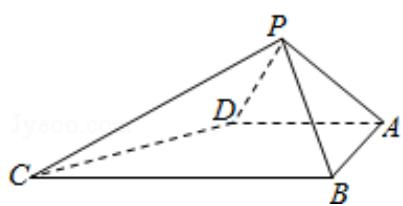

<!-- question-source:start -->
19. （12分）如图，四棱锥P-ABCD中， $\angle ABC = \angle BAD = 90^{\circ}$ ，BC=2AD， $\triangle PAB$ 与 $\triangle PAD$ 都是边长为2的等边三角形.

(Ⅰ) 证明: PB⊥CD;

(II) 求点 A 到平面 PCD 的距离.

<!-- question-source:end -->

![[高中/真题/按年份分类/2013/2013年全国统一高考数学试卷_文科__大纲版__含解析版_/解答题/题目/answers/Q00027076A1.md]]
