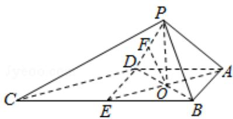

> [!faq]- 2013年全国统一高考数学试卷（文科）（大纲版）（含解析版）解析
>
> > [!success]- **【答案】** 详见解析
>
> > [!note]- **【分析】**
> > (Ⅰ) 取 BC 的中点 E, 连接 DE, 则 ABED 为正方形, 过 P 作 PO⊥平面 ABCD,
>
> > [!note]- **【解析】**
> > （Ⅰ）证明：取 BC 的中点 E，连接 DE，则 ABED 为正方形，过 P 作 PO⊥平面
> >
> > ABCD，垂足为 O，连接 OA，OB，OD，OE
> >
> > 由 $\triangle PAB$ 和 $\triangle PAD$ 都是等边三角形知 PA=PB=PD
> >
> > ∴OA=OB=OD，即 O 为正方形 ABED 对角线的交点
> >
> > ∴OE⊥BD，∴PB⊥OE
> >
> > ∵O 是 BD 的中点，E 是 BC 的中点，∴OE∥CD
> >
> > ∴PB⊥CD;
> >
> > (II) 取 PD 的中点 F，连接 OF，则 OF∥PB
> >
> > 由（Ⅰ）知 PB⊥CD，∴OF⊥CD，
> >
> > $$
> > \because O D = \frac {1}{2} B D = \sqrt {2}, O P = \sqrt {P D ^ {2} - O D ^ {2}} = \sqrt {2}
> > $$
> >
> > ∴△POD 为等腰三角形，∴OF⊥PD
> >
> > ∵PD∩CD=D，∴OF⊥平面PCD
> >
> > ∵AE∥CD，CDC平面PCD，AE⊂平面PCD，∴AE∥平面PCD
> >
> > ∴O 到平面 PCD 的距离 OF 就是 A 到平面 PCD 的距离
> >
> > $$
> > \because O F = \frac {1}{2} P B = 1
> > $$
> >
> > ∴点 A 到平面 PCD 的距离为 1.
> >
> > 
> >
> > 【点评】本题考查线线垂直，考查点到面的距离的计算，考查学生转化的能力，考
> >
> > 查学生
