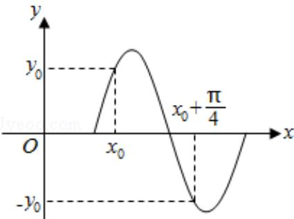

<!-- question-source:start -->
9. （5分）若函数 $y = \sin (\omega x + \varphi) \quad (\omega > 0)$ 的部分图象如图，则 $\omega = (\quad)$

A. 5 B. 4 C. 3 D. 2

【考点】HK: 由 $y = \text{Asin}(\omega x + \varphi)$ 的部分图象确定其
<!-- question-source:end -->

![[高中/真题/按年份分类/2013/2013年全国统一高考数学试卷_文科__大纲版__含解析版_/选择题/题目/answers/Q00027110A1.md]]
