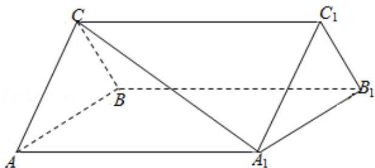

<!-- question-source:start -->
19. （12分）如图，三棱柱 $ABC-A_{1}B_{1}C_{1}$ 中，CA=CB， $AB=AA_{1}$ ， $\angle BAA_{1}=60^{\circ}$

(Ⅰ) 证明: $AB \perp A_{1}C$ ;

（II）若 AB=CB=2， $A_{1}C=\sqrt{6}$ ，求三棱柱 ABC- $A_{1}B_{1}C_{1}$ 的体积.

<!-- question-source:end -->

![[高中/真题/按年份分类/2013/2013年全国统一高考数学试卷_文科__新课标ⅰ__含解析版_/填空题/题目/answers/Q00024789A1.md]]
