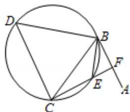

<!-- question-source:start -->
22. （10 分）（选修 4 - 1：几何证明选讲）

如图，直线 AB 为圆的切线，切点为 B，点 C 在圆上， $\angle ABC$ 的角平分线 BE 交圆于

点 E，DB 垂直 BE 交圆于 D.

(Ⅰ) 证明: DB=DC;

（II）设圆的半径为 1， $BC=\sqrt{3}$ ，延长 CE 交 AB 于点 F，求 $\triangle BCF$ 外接圆的半径.

<!-- question-source:end -->

![[高中/真题/按年份分类/2013/2013年全国统一高考数学试卷_文科__新课标ⅰ__含解析版_/填空题/题目/answers/Q00024792A1.md]]
