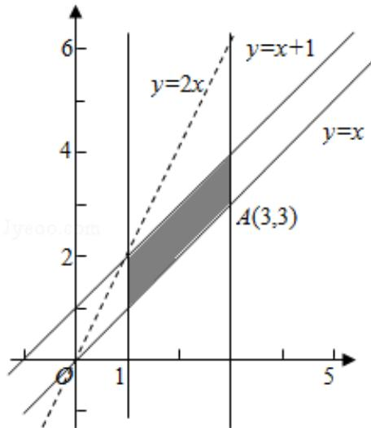

> [!faq]- 2013年全国统一高考数学试卷（文科）（新课标ⅰ）（含解析版）解析
>
> > [!success]- **【答案】** 为：3.  【点评】本题主要考查了简单的线性规划，以及利用几何意义求最值，属于基础题.
>
> > [!note]- **【分析】**
> > 先根据约束条件画出可行域，再利用几何意义求最值，z=2x-y 表示直线
>
> > [!note]- **【解析】**
> > 分析】先根据约束条件画出可行域，再利用几何意义求最值，z=2x-y 表示直线
> >
> > 在 y 轴上的截距，只需求出可行域直线在 y 轴上的截距最大值即可.
> >
> > 【
> > 解答】解：不等式组表示的平面区域如图所示，
> >
> > 由 $\left\{\begin{aligned}x=3\\ y=x\end{aligned}\right.$ 得A（3，3），
> >
> > z=2x-y 可转换成 y=2x-z，z 最大时，y 值最小，
> >
> > 即：当直线 $z = 2x - y$ 过点A（3，3）时，
> >
> > 在 y 轴上截距最小，此时 z 取得最大值 3.
> >
> > 故
> > 答案为：3.
> >
> > 
> >
> > 【点评】本题主要考查了简单的线性规划，以及利用几何意义求最值，属于基础题.
