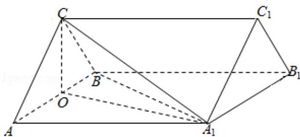

> [!faq]- 2013年全国统一高考数学试卷（文科）（新课标ⅰ）（含解析版）解析
>
> > [!success]- **【答案】** 详见解析
>
> > [!note]- **【分析】**
> > （Ⅰ）由题目给出的边的关系，可想到去 AB 中点 O，连结 OC， $OA_{1}$ ，可通过
>
> > [!note]- **【解析】**
> > 分析】（Ⅰ）由题目给出的边的关系，可想到去 AB 中点 O，连结 OC， $OA_{1}$ ，可通过
> >
> > 证明 AB⊥平面 $OA_{1}C$ 得要证的结论；
> >
> > （II）在三角形 $OCA_{1}$ 中，由勾股定理得到 $OA_{1} \perp OC$ ，再根据 $OA_{1} \perp AB$ ，得到 $OA_{1}$ 为
> >
> > 三棱柱 ABC - A $_{1}$ B $_{1}$ C $_{1}$ 的高，利用已知给出的边的长度，直接利用棱柱体积公式
> >
> > 求体积.
> >
> > 【
> > 解答】（Ⅰ）证明：如图，
> >
> > 取 AB 的中点 O，连结 OC， $OA_{1}$ ， $A_{1}B$ 。
> >
> > 因为 CA=CB，所以 OC⊥AB.
> >
> > 由于 $AB = AA_{1}$ ， $\angle BAA_{1} = 60^{\circ}$ ，故 $\triangle AA_{1}B$ 为等边三角形，
> >
> > 所以 $OA_{1} \perp AB$ .
> >
> > 因为 $OC \cap OA_{1} = O$ ，所以 AB ⊥ 平面 $OA_{1}C$ .
> >
> > 又 $A_{1}C \subset$ 平面 $OA_{1}C$ ，故 $AB \perp A_{1}C$ ;
> >
> > （II）解：由题设知 $\triangle ABC$ 与 $\triangle AA_{1}B$ 都是边长为2的等边三角形，
> >
> > 所以 $OC = 0A_{1} = \sqrt{3}$
> >
> > 又 $A_{1}C=\sqrt{6}$ ，则 $A_{1}C^{2}=OC^{2}+OA_{1}^{2}$ ，故 $OA_{1}\perp OC$ 。
> >
> > 因为 $OC \cap AB = O$ ，所以 $OA_{1} \perp$ 平面 ABC， $OA_{1}$ 为三棱柱 $ABC - A_{1}B_{1}C_{1}$ 的高.
> >
> > 又 $\triangle ABC$ 的面积 $S_{\triangle ABC} = \sqrt{3}$ ，故三棱柱 $ABC - A_1B_1C_1$ 的体积
> >
> > $$
> > V = S _ {\triangle A B C} \times O A _ {1} = \sqrt {3} \times \sqrt {3} = 3.
> > $$
> >
> > 
> >
> > 【点评】题主要考查了直线与平面垂直的性质,考查了棱柱的体积,考查空间想象
> >
> > 能力、运算能力和推理论证能力，属于中档题.
