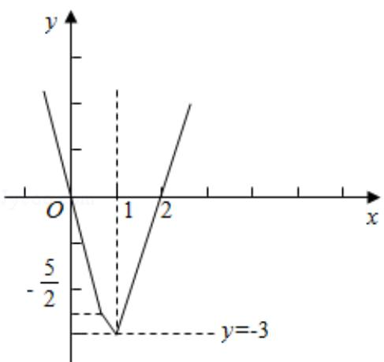

> [!faq]- 2013年全国统一高考数学试卷（文科）（新课标ⅰ）（含解析版）解析
>
> > [!success]- **【答案】** 详见解析
>
> > [!note]- **【分析】**
> > （Ⅰ）当 a = -2 时，求不等式 $f(x) < g(x)$ 化为 $\left|2x - 1\right| + \left|2x - 2\right| - x - 3 <$
>
> > [!note]- **【解析】**
> > 解：
> > （1）当 $a = -2$ 时，求不等式 $f(x) < g(x)$ 化为 $|2x - 1| + |2x - 2| - x - 3 < 0$ .
> >
> > 设 $y = |2x - 1| + |2x - 2| - x - 3$ ，则 $y = \begin{cases} -5x, & x < \frac{1}{2} \\ -x - 2, & \frac{1}{2} \leqslant x \leqslant 1 \\ 3x - 6, & x > 1 \end{cases}$ ，它的图象如图所示：
> >
> > 结合图象可得，y<0 的解集为 $(0,2)$ ，故原不等式的解集为 $(0,2)$ 。
> >
> > （Ⅱ）设 $a > -1$ ，且当 $x \in [-\frac{a}{2}, \frac{1}{2}]$ 时， $f(x) = 1 + a$ ，不等式化为 $1 + a \leq x + 3$ ，故 $x \geq a - 2$ 对 $x \in [-\frac{a}{2}, \frac{1}{2}]$ 都成立.
> >
> > 故 $-\frac{a}{2} \geqslant a - 2$
> >
> > 解得 $a \leq \frac{4}{3}$ ,
> >
> > 故 a 的取值范围为 $(-1, \frac{4}{3}]$ .
> >
> > 
> >
> > 【点评】本题考查绝对值不等式的解法与绝对值不等式的性质，关键是利用零点
> >
> > 分段讨论法
