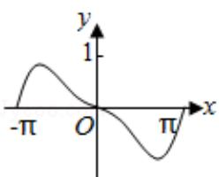
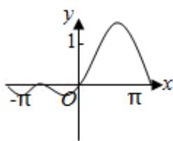
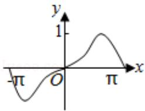
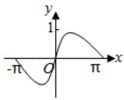

<!-- question-source:start -->
9. (5分) 函数 $f(x) = (1 - \cos x) \sin x$ 在 $[- \pi, \pi]$ 的图象大致为（）

A.

B.

C.

D.

<!-- question-source:end -->

![[高中/真题/按年份分类/2013/2013年全国统一高考数学试卷_文科__新课标ⅰ__含解析版_/选择题/题目/answers/Q00024779A1.md]]
