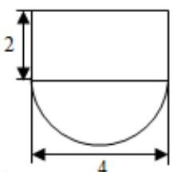
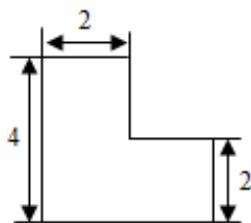
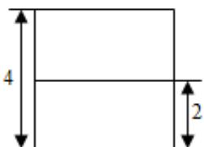

<!-- question-source:start -->
11. （5 分）某几何体的三视图如图所示，则该几何体的体积为（）

A. $16 + 8\pi$ B. $8 + 8\pi$ C. $16 + 16\pi$ D. $8 + 16\pi$
<!-- question-source:end -->

![[高中/真题/按年份分类/2013/2013年全国统一高考数学试卷_文科__新课标ⅰ__含解析版_/选择题/题目/answers/Q00024781A1.md]]
