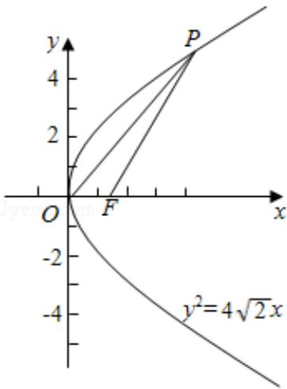

> [!faq]- 2013年全国统一高考数学试卷（文科）（新课标ⅰ）（含解析版）解析
>
> > [!success]- **【答案】** C
>
> > [!note]- **【分析】**
> > 根据抛物线方程，算出焦点 F 坐标为 $(\sqrt{2}, 0)$ . 设 P(m, n)，由抛物线的
>
> > [!note]- **【解析】**
> > 解：∵抛物线 C 的方程为 $y^{2}=4\sqrt{2}x$
> >
> > $\therefore 2p = 4\sqrt{2}$ ，可得 $\frac{p}{2} = \sqrt{2}$ ，得焦点F（ $\sqrt{2}$ ，0）
> >
> > 设 P (m, n)
> >
> > 根据抛物线的定义，得 $|PF|=m+\frac{p}{2}=4\sqrt{2}$ ，
> >
> > 即 $m + \sqrt{2} = 4\sqrt{2}$ ，解得 $m = 3\sqrt{2}$
> >
> > ∵点P在抛物线C上，得 $n^{2}=4\sqrt{2}\times3\sqrt{2}=24$
> >
> > $$
> > \therefore n = \pm \sqrt {2 4} = \pm 2 \sqrt {6}
> > $$
> >
> > $$
> > \because | O F | = \sqrt {2}
> > $$
> >
> > $\therefore \triangle POF$ 的面积为 $S = \frac{1}{2} |\mathrm{OF}|\times |\mathrm{n}| = \frac{1}{2}\times \sqrt{2}\times 2\sqrt{6} = 2\sqrt{3}$
> >
> > 故选：C.
> >
> > 
> >
> > 【点评】本题给出抛物线 C: $y^{2}=4\sqrt{2}x$ 上与焦点 F 的距离为 $4\sqrt{2}$ 的点 P，求 $\triangle POF$ 的面积。着重考查了三角形的面积公式、抛物线的标准方程和简单几何性质等知识，属于基础题。
