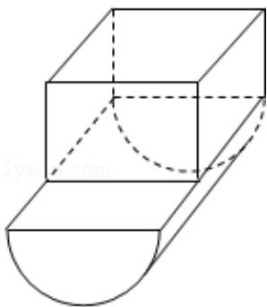

> [!faq]- 2013年全国统一高考数学试卷（文科）（新课标ⅰ）（含解析版）解析
>
> > [!success]- **【答案】** A
>
> > [!note]- **【分析】**
> > 三视图复原的几何体是一个长方体与半个圆柱的组合体，依据三视图的
>
> > [!note]- **【解析】**
> > 解：三视图复原的几何体是一个长方体与半个圆柱的组合体，如图，其中
> >
> > 长方体长、宽、高分别是：4，2，2，半个圆柱的底面半径为2，母线长为4.
> >
> > ∴长方体的体积= $4\times2\times2=16$ ，
> >
> > 半个圆柱的体积 $= \frac{1}{2} \times 2^{2} \times \pi \times 4 = 8\pi$
> >
> > 所以这个几何体的体积是 $16+8\pi$ ;
> >
> > 故选：A.
> >
> > 
> >
> > 【点评】本题考查了几何体的三视图及直观图的画法，三视图与直观图的关系，柱体体积计算公式，空间想象能力
