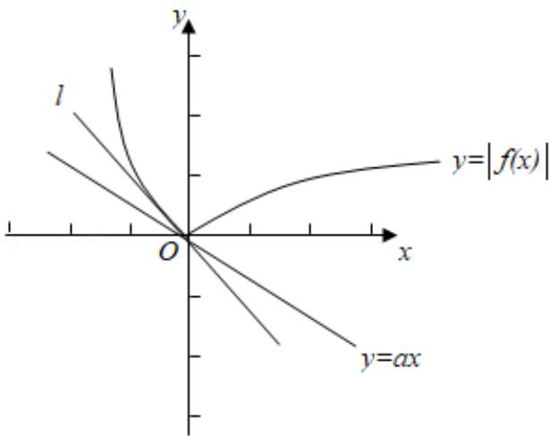

> [!faq]- 2013年全国统一高考数学试卷（文科）（新课标ⅰ）（含解析版）解析
>
> > [!success]- **【答案】** D
>
> > [!note]- **【分析】**
> > 由函数图象的变换, 结合基本初等函数的图象可作出函数 $y = |f(x)|$ 的图象, 和函数 $y = ax$ 的图象, 由导数求切线斜率可得 $l$ 的斜率, 进而数形结合可得 $a$ 的范围.
>
> > [!note]- **【解析】**
> > 式为 $y = x^2 - 2x$ ，
> >
> > 
> >
> > 求其导数可得 $y' = 2x - 2$ ，因为 $x \leq 0$ ，故 $y' \leq -2$ ，故直线 l 的斜率为 -2，
> >
> > 故只需直线 y=ax 的斜率 a 介于 -2 与 0 之间即可，即 $a \in [-2, 0]$
> >
> > 故选：D.
> >
> > 【点评】本题考查其它不等式的解法，数形结合是解决问题的关键，属中档题.
> >
> > ## 二．填空题：本大题共四小题，每小题5分.
