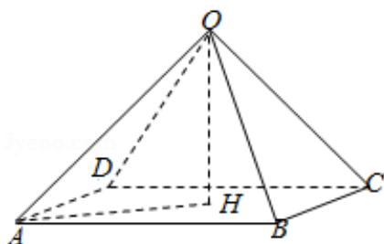

> [!faq]- 2013年全国统一高考数学试卷（文科）（新课标ⅱ）（含解析版）解析
>
> > [!success]- **【答案】** 为： $24\pi$  【点评】本题考查锥体的体积、球的表面积计算,考查学生的运算能力,属基础题.
>
> > [!note]- **【分析】**
> > 先直接利用锥体的体积公式即可求得正四棱锥 O-ABCD 的高，再利用直
>
> > [!note]- **【解析】**
> > 分析】先直接利用锥体的体积公式即可求得正四棱锥 O-ABCD 的高，再利用直
> >
> > 算即得.
> >
> > 【
> > 解答】解：如图，正四棱锥 O-ABCD 的体积 $V=\frac{1}{3}sh=\frac{1}{3}\left(\sqrt{3}\times\sqrt{3}\right)\times OH=\frac{3\sqrt{2}}{2}$ ，
> > ∴OH= $\frac{3\sqrt{2}}{2}$ ,
> >
> > 在直角三角形 OAH 中， $OA=\sqrt{OH^{2}+AH^{2}}=\sqrt{\left(\frac{3\sqrt{2}}{2}\right)^{2}+\left(\frac{\sqrt{6}}{2}\right)^{2}}=\sqrt{6}$
> >
> > 所以表面积为 $4\pi r^{2}=24\pi$ ;
> >
> > 故
> > 答案为： $24\pi$
> >
> > 
> >
> > 【点评】本题考查锥体的体积、球的表面积计算,考查学生的运算能力,属基础题.
