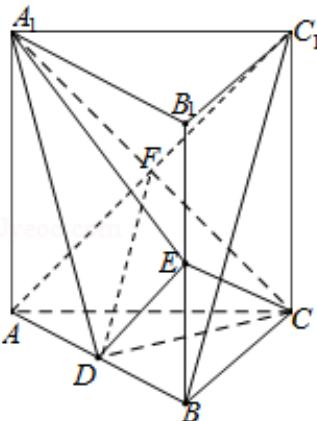

> [!faq]- 2013年全国统一高考数学试卷（文科）（新课标ⅱ）（含解析版）解析
>
> > [!success]- **【答案】** 详见解析
>
> > [!note]- **【分析】**
> > （Ⅰ）连接 $AC_{1}$ 交 $A_{1}C$ 于点 F，则 DF 为三角形 $ABC_{1}$ 的中位线，故 $DF\parallel BC_{1}$ . 再
>
> > [!note]- **【解析】**
> > 分析】（Ⅰ）连接 $AC_{1}$ 交 $A_{1}C$ 于点 F，则 DF 为三角形 $ABC_{1}$ 的中位线，故 $DF\parallel BC_{1}$ . 再
> >
> > 根据直线和平面平行的判定定理证得
> >
> > $BC_{1}$ || 平面 $A_{1}CD$ .
> >
> > （II）由题意可得此直三棱柱的底面 ABC 为等腰直角三角形，由 D 为 AB 的中点可
> >
> > 得 CD⊥平面 $ABB_{1}A_{1}$ 。求得 CD 的值，利用
> >
> > 勾股定理求得 $\mathrm{A}_1\mathrm{D}$ 、DE和 $\mathrm{A}_1\mathrm{E}$ 的值，可得 $\mathrm{A}_1\mathrm{D} \perp \mathrm{DE}$ . 进而求得 ${}^{\mathrm{S}}\triangle \mathrm{A}_{1}\mathrm{DE}$ 的值，再根据
> >
> > 三棱锥 C - A₁DE 的体积
> >
> > 为 $\frac{1}{3}\cdot S_{\triangle A_{1}DE}\cdot CD$ ，运算求得结果.
> >
> > 【
> > 解答】解：（Ⅰ）证明：连接 $AC_{1}$ 交 $A_{1}C$ 于点 F，则 F 为 $AC_{1}$ 的中点.
> >
> > ∵直棱柱 $ABC-A_{1}B_{1}C_{1}$ 中，D，E 分别是 AB， $BB_{1}$ 的中点，故 DF 为三角形 $ABC_{1}$ 的中位
> >
> > 线，故 $DF \parallel BC_{1}$ .
> >
> > 由于 DFC 平面 $A_{1}CD$ ，而 $BC_{1}$ 不在平面 $A_{1}CD$ 中，故有 $BC_{1} \parallel$ 平面 $A_{1}CD$ .
> >
> > 
> >
> > （II） $\because AA_{1}=AC=CB=2, AB=2\sqrt{2}$ ，故此直三棱柱的底面 ABC 为等腰直角三角形.
> >
> > 由 D 为 AB 的中点可得 CD⊥平面 ABB₁A₁，∴CD= $\frac{AC\cdot BC}{AB}=\sqrt{2}$ .
> >
> > $\because A_{1}D = \sqrt{A_{1}A^{2} + AD^{2}} = \sqrt{6}$ ，同理，利用勾股定理求得 $DE = \sqrt{3}$ ， $A_{1}E = 3$ 。
> >
> > 再由勾股定理可得 $A_{1}D^{2}+DE^{2}=A_{1}E^{2},\therefore A_{1}D\perp DE.$
> >
> > $\therefore S_{\triangle A_1DE} = \frac{1}{2} \cdot A_1D \cdot DE = \frac{3\sqrt{2}}{2}$ ,
> >
> > $$
> > \therefore V _ {C - A _ {1} D E} = \frac {1}{3} \cdot S _ {\triangle A _ {1} D E} \cdot C D = 1.
> > $$
> >
> > 【点评】本题主要考查直线和平面平行的判定定理的应用, 求三棱锥的体积, 体现
> >
> > 了数形结合的数学思想，属于中档题.
