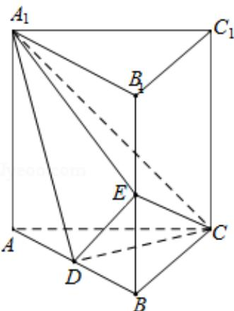

<!-- question-source:start -->
18. （12分）如图，直三棱柱 $ABC-A_{1}B_{1}C_{1}$ 中，D，E分别是AB， $BB_{1}$ 的中点

（Ⅰ）证明： $BC_{1}$ || 平面 $A_{1}CD$ ;

（II） $AA_{1}=AC=CB=2,\ AB=2\sqrt{2}$ ，求三棱锥 $C-A_{1}DE$ 的体积.

<!-- question-source:end -->

![[高中/真题/按年份分类/2013/2013年全国统一高考数学试卷_文科__新课标ⅱ__含解析版_/解答题/题目/answers/Q00025250A1.md]]
