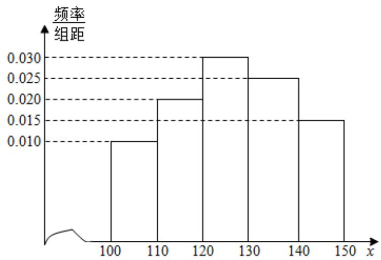

<!-- question-source:start -->
19. (12 分) 经销商经销某种农产品, 在一个销售季度内, 每售出 1t 该产品获利润
500 元, 未售出的产品, 每 1t 亏损 300 元. 根据历史资料, 得到销售季度内市场
需求量的频率分布直方图, 如图所示. 经销商为下一个销售季度购进了 130t
该农产品. 以 X (单位: t, $100 \leq X \leq 150$ ) 表示下一个销售季度内的市场需求量,
T (单位: 元) 表示下一个销售季度内经销该农产品的利润.

  
（Ⅰ）将T表示为X的函数；

（Ⅱ）根据直方图估计利润 T 不少于 57000 元的概率.
<!-- question-source:end -->

![[高中/真题/按年份分类/2013/2013年全国统一高考数学试卷_文科__新课标ⅱ__含解析版_/解答题/题目/answers/Q00025251A1.md]]
