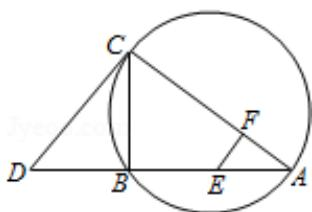

<!-- question-source:start -->
22. 【选修4-1几何证明选讲】

如图，CD为 $\triangle ABC$ 外接圆的切线，AB的延长线交直线CD于点D，E、F分别为弦

AB 与弦 AC 上的点，且 BC·AE=DC·AF，B、E、F、C 四点共圆.

(1) 证明: CA 是 $\triangle ABC$ 外接圆的直径;

(2) 若 DB=BE=EA，求过 B、E、F、C 四点的圆的面积与 $\triangle ABC$ 外接圆面积的比值.

<!-- question-source:end -->

![[高中/真题/按年份分类/2013/2013年全国统一高考数学试卷_文科__新课标ⅱ__含解析版_/解答题/题目/answers/Q00025254A1.md]]
