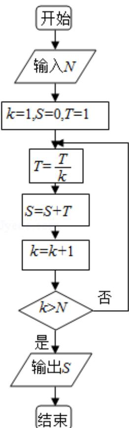

<!-- question-source:start -->
7. （5分）执行如图的程序框图，如果输入的 $N = 4$ ，那么输出的 $S =$ （ ）

A. $1 + \frac{1}{2} + \frac{1}{3} + \frac{1}{4}$ B. $1 + \frac{1}{2} + \frac{1}{3 \times 2} + \frac{1}{4 \times 3 \times 2}$ C. $1 + \frac{1}{2} + \frac{1}{3} + \frac{1}{4} + \frac{1}{5}$ D. $1 + \frac{1}{2} + \frac{1}{3 \times 2} + \frac{1}{4 \times 3 \times 2} + \frac{1}{5 \times 4 \times 3 \times 2}$
<!-- question-source:end -->

![[高中/真题/按年份分类/2013/2013年全国统一高考数学试卷_文科__新课标ⅱ__含解析版_/选择题/题目/answers/Q00025239A1.md]]
