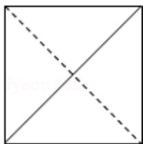
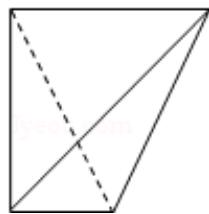
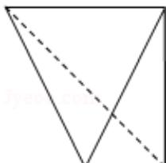
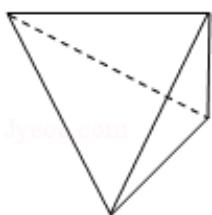

<!-- question-source:start -->
9. （5 分）一个四面体的顶点在空间直角坐标系 O - xyz 中的坐标分别是
(1,0,1), (1,1,0), (0,1,1), (0,0,0), 画该四面体三视图中的正视图时,
以 zOx 平面为投影面, 则得到正视图可以为 ( )

A.

B.

C.

D.
<!-- question-source:end -->

![[高中/真题/按年份分类/2013/2013年全国统一高考数学试卷_文科__新课标ⅱ__含解析版_/选择题/题目/answers/Q00025241A1.md]]
