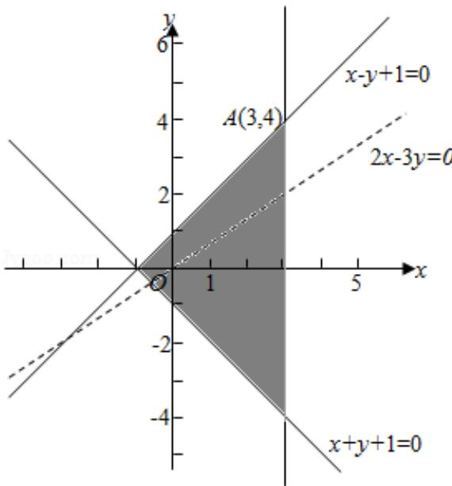

> [!faq]- 2013年全国统一高考数学试卷（文科）（新课标ⅱ）（含解析版）解析
>
> > [!success]- **【答案】** B
>
> > [!note]- **【分析】**
> > 先画出满足约束条件： $\left\{\begin{aligned}x-y+1&\geqslant0\\ x+y+1&\geqslant0\\ x&\leqslant3\end{aligned}\right.$ ，的平面区域，求出平面区域的各角点，
> > 然后将角点坐标代入目标函数，比较后，即可得到目标函数 z=2x-3y 的最小
>
> > [!note]- **【解析】**
> > 解：根据题意，画出可行域与目标函数线如下图所示，
> >
> > 由 $\left\{\begin{aligned}x-y+1&=0\\ x&=3\end{aligned}\right.$ 得 $\left\{\begin{aligned}x&=3\\ y&=4\end{aligned}\right.$
> >
> > 由图可知目标函数在点 A（3，4）取最小值 $z=2\times3-3\times4=-6$ .
> >
> > 故选：B.
> >
> > 
> >
> > 【点评】用图解法解决线性规划问题时, 分析题目的已知条件, 找出约束条件和目
> > 标函数是关键, 可先将题目中的量分类、列出表格, 理清头绪, 然后列出不等
> > 式组（方程组）寻求约束条件, 并就题目所述找出目标函数. 然后将可行域各
> > 角点的值——代入, 最后比较, 即可得到目标函数的最优解.
