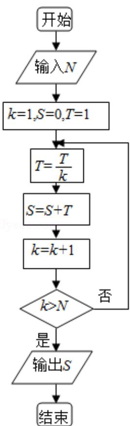

> [!faq]- 2013年全国统一高考数学试卷（文科）（新课标ⅱ）（含解析版）解析
>
> > [!success]- **【答案】** B
>
> > [!note]- **【分析】**
> > 由程序中的变量、各语句的作用, 结合流程图所给的顺序可知当条件满足时, 用 $S + \frac{T}{k}$ 的值代替 $S$ 得到新的 $S$ , 并用 $k + 1$ 代替 $k$ , 直到条件不能满足时输出最后算出的 s 值，由此即可得到本题答案.
>
> > [!note]- **【解析】**
> > 解：根据题意，可知该按以下步骤运行
> >
> > 第一次：S=1，
> >
> > 第二次： $S=1+\frac{1}{2}$ ,
> >
> > 第三次： $S=1+\frac{1}{2}+\frac{1}{3\times2}$ ，
> >
> > 第四次： $S=1+\frac{1}{2}+\frac{1}{3\times2}+\frac{1}{4\times3\times2}$
> >
> > 此时 k=5 时，符合 k>N=4，输出 S 的值.
> >
> > $$
> > \therefore S = 1 + \frac {1}{2} + \frac {1}{3 \times 2} + \frac {1}{4 \times 3 \times 2}
> > $$
> >
> > 故选：B.
> >
> > 
> >
> > 【点评】本题主要考查了直到型循环结构, 循环结构有两种形式: 当型循环结构和
> >
> > 直到型循环结构，以及表格法的运用，属于基础题.
