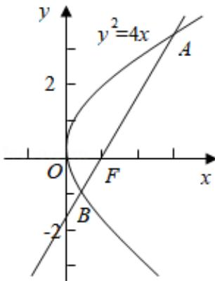

> [!faq]- 2013年全国统一高考数学试卷（文科）（新课标ⅱ）（含解析版）解析
>
> > [!success]- **【答案】** C
>
> > [!note]- **【分析】**
> > 根据题意, 可得抛物线焦点为 F(1,0), 由此设直线 l 方程为 y=k(x-1)
>
> > [!note]- **【解析】**
> > 解：∵抛物线 C 方程为 $y^{2}=4x$ ，可得它的焦点为 F（1，0），
> >
> > ∴设直线l方程为 y=k (x - 1)
> >
> > 由 $\left\{ \begin{array}{l} y = k(x - 1) \\ y^2 = 4x \end{array} \right.$ 消去 $x$ ，得 $\frac{k}{4} y^2 - y - k = 0$
> >
> > 设 A $(x_{1}, y_{1})$ ，B $(x_{2}, y_{2})$ ，
> >
> > 可得 $y_{1}+y_{2}=\frac{4}{k}$ ， $y_{1}y_{2}=-4\ldots(*)$
> >
> > ∵|AF|=3|BF|,
> >
> > $\therefore y_{1} + 3y_{2} = 0$ ，可得 $y_{1} = -3y_{2}$ ，代入（\*）得 $-2y_{2} = \frac{4}{k}$ 且 $-3y_{2}^{2} = -4$
> >
> > 消去 $\mathsf{y}_2$ 得 $k^2 = 3$ ，解之得 $k = \pm \sqrt{3}$
> >
> > ∴直线l方程为 $y=\sqrt{3}$ (x-1) 或 $y=-\sqrt{3}$ (x-1)
> >
> > 故选：C.
> >
> > 
> >
> > 【点评】本题给出抛物线的焦点弦 AB 被焦点 F 分成 1:3 的两部分，求直线 AB 的方程，着重考查了抛物线的标准方程、简单几何性质和直线与圆锥曲线的位置关系等知识，属于中档题.
