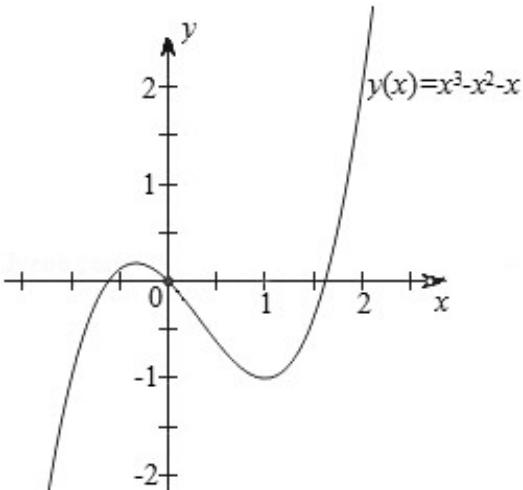

> [!faq]- 2013年全国统一高考数学试卷（文科）（新课标ⅱ）（含解析版）解析
>
> > [!success]- **【答案】** C
>
> > [!note]- **【分析】**
> > 对于 A，对于三次函数 $f(x)=x^{3}+ax^{2}+bx+c$ ，由于当 $x\to-\infty$ 时， $y\to-\infty$ ，当
>
> > [!note]- **【解析】**
> > 解：
> >
> > A、对于三次函数 $f(x)=x^{3}+ax^{2}+bx+c$ ,
> >
> > A: 由于当 $x \to -\infty$ 时， $y \to -\infty$ ，当 $x \to +\infty$ 时， $y \to +\infty$ ，
> >
> > 故 $\exists x_0 \in R, f(x_0) = 0$ ，故 $A$ 正确；
> >
> > $$
> > B 、 \because f (- \frac {2 a}{3} - x) + f (x) = (- \frac {2 a}{3} - x) ^ {3} + a (- \frac {2 a}{3} - x) ^ {2} + b (- \frac {2 a}{3} - x)
> > $$
> >
> > $$
> > + c + x ^ {3} + a x ^ {2} + b x + c = \frac {4 a ^ {3}}{2 7} - \frac {2 a b}{3} + 2 c,
> > $$
> >
> > $$
> > f \left(- \frac {a}{3}\right) = \left(- \frac {a}{3}\right) ^ {3} + a \left(- \frac {a}{3}\right) ^ {2} + b \left(- \frac {a}{3}\right) + c = \frac {2 a ^ {3}}{2 7} - \frac {a b}{3} + c,
> > $$
> >
> > $$
> > \because f \left(- \frac {2 a}{3} - x\right) + f (x) = 2 f \left(- \frac {a}{3}\right),
> > $$
> >
> > ∴点 P（ $-\frac{a}{3}$ ，f（ $-\frac{a}{3}$ ））为对称中心，故 B 正确.
> >
> > C、若取 a = -1, b = -1, c = 0，则 f(x) = x $^{3}$ - x $^{2}$ - x,
> >
> > 对于 $f(x) = x^{3} - x^{2} - x, \because f'(x) = 3x^{2} - 2x - 1$
> >
> > ∴由 $f'(x) = 3x^{2} - 2x - 1 > 0$ 得 $x \in (-\infty, -\frac{1}{3}) \cup (1, +\infty)$
> >
> > 由 $f'(x) = 3x^{2} - 2x - 1 < 0$ 得 $x \in (-\frac{1}{3}, 1)$
> >
> > ∴函数 $f(x)$ 的单调增区间为： $(-∞, -\frac{1}{3})$ ， $(1, +∞)$ ，减区间为： $(- \frac{1}{3}, 1)$ ，
> > 故 1 是 $f(x)$ 的极小值点，但 $f(x)$ 在区间 $(-∞, 1)$ 不是单调递减，故 C 错误；
> > D: 若 $x_{0}$ 是 $f(x)$ 的极值点，根据导数的意义，则 $f'(x_{0}) = 0$ ，故 D 正确.
> >
> > 由于该题选择错误的，故选：C.
> >
> > 
