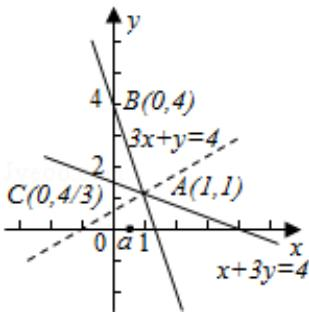

> [!faq]- 2013年全国统一高考数学试卷（理科）（大纲版）（含解析版）解析
>
> > [!success]- **【答案】** 为： $[\frac{1}{2}, 4]$  【点评】在解决线性规划的小题时，我们常用“角点法”，其步骤为：①由约束条 件画出可行域⇒②求出可行域各个角点的坐标⇒③将坐标逐一代入目标函数 $\Rightarrow④$ 验证，求出最优解.
>
> > [!note]- **【分析】**
> > 本题考查的知识点是简单线性规划的应用，我们要先画出满足约束条件
>
> > [!note]- **【解析】**
> > 分析】本题考查的知识点是简单线性规划的应用，我们要先画出满足约束条件
> >
> > $\left\{ \begin{array}{l} x \geqslant 0 \\ x + 3y \geqslant 4 \text{的平面区域，然后
> > 分析平面区域里各个角点，然后将其代入} \\ 3x + y \leqslant 4 \end{array} \right.$
> >
> > $y=a(x+1)$ 中，求出 $y=a(x+1)$ 对应的a的端点值即可.
> >
> > 【
> > 解答】解：满足约束条件 $\left\{\begin{aligned}x&\geqslant0\\ x+3y&\geqslant4\end{aligned}\right.$ 的平面区域如图示： $3x+y\leqslant4$
> >
> > 因为 $y = a(x + 1)$ 过定点（-1，0）.
> >
> > 所以当 $y=a(x+1)$ 过点 B(0,4) 时，得到 a=4，
> >
> > 当 $y=a(x+1)$ 过点 A(1, 1) 时，对应 $a=\frac{1}{2}$ .
> >
> > 又因为直线 $y=a(x+1)$ 与平面区域 D 有公共点.
> >
> > 所以 $\frac{1}{2}\leqslant a\leq4.$
> >
> > 故
> > 答案为： $[\frac{1}{2}, 4]$
> >
> > 
> >
> > 【点评】在解决线性规划的小题时，我们常用“角点法”，其步骤为：①由约束条
> >
> > 件画出可行域⇒②求出可行域各个角点的坐标⇒③将坐标逐一代入目标函数
> >
> > $\Rightarrow④$ 验证，求出最优解.
