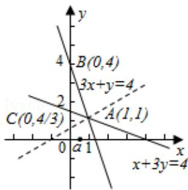

> [!faq]- 2013年全国统一高考数学试卷（理科）（大纲版）（含解析版）解析
>
> > [!success]- **【答案】** $[\frac{1}{2}, 4]$
>
> > [!note]- **【分析】**
> > 本题考查的知识点是简单线性规划的应用，我们要先画出满足约束条件
>
> > [!note]- **【解析】**
> > 解：满足约束条件 $\left\{\begin{aligned}x&\geqslant0\\ x+3y&\geqslant4\\ 3x+y&\leqslant4\end{aligned}\right.$ 的平面区域如图示：
> >
> > 因为 $y=a(x+1)$ 过定点 $(-1,0)$ .
> >
> > 所以当 $y=a(x+1)$ 过点 B(0,4) 时，得到 a=4，
> >
> > 当 $y=a(x+1)$ 过点 A(1, 1) 时，对应 $a=\frac{1}{2}$ .
> >
> > 又因为直线 y=a（x+1）与平面区域 D 有公共点.
> >
> > 所以 $\frac{1}{2} \leqslant a \leq 4$ .
> >
> > 故答案为： $[\frac{1}{2}, 4]$
> >
> > 
> >
> > 【点评】在解决线性规划的小题时, 我们常用 “角点法”, 其步骤为: ①由约束条
> >
> > 件画出可行域⇒②求出可行域各个角点的坐标⇒③将坐标逐一代入目标函数
> >
> > $\Rightarrow④$ 验证，求出最优解.
