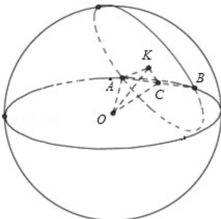

> [!faq]- 2013年全国统一高考数学试卷（理科）（大纲版）（含解析版）解析
>
> > [!success]- **【答案】** 为 $16\pi$  【点评】本题考查球的表面积，考查学生
>
> > [!note]- **【分析】**
> > 正确作出图形，利用勾股定理，建立方程，即可求得结论.
>
> > [!note]- **【解析】**
> > 分析】正确作出图形，利用勾股定理，建立方程，即可求得结论.
> >
> > 【
> > 解答】解：如图所示，设球 O 的半径为 r，AB 是公共弦， $\angle OCK$ 是面面角
> >
> > 根据题意得 OC= $\frac{\sqrt{3}}{2}$ r，CK= $\frac{\sqrt{3}}{4}$ r
> >
> > 在 $\triangle$ OCK中，OC²=OK²+CK²，即 $\frac{3}{4}\mathrm{r}^2 = \frac{9}{4} +\frac{3}{16}\mathrm{r}^2$
> >
> > $$
> > \therefore r ^ {2} = 4
> > $$
> >
> > ∴球 O 的表面积等于 $4\pi r^{2}=16\pi$
> >
> > 故
> > 答案为 $16\pi$
> >
> > 
> >
> > 【点评】本题考查球的表面积，考查学生
> > 分析解决问题的能力，属于中档题.
> >
> > 三、解答题：
> > 解答应写出文字说明、证明过程或演算步骤.
