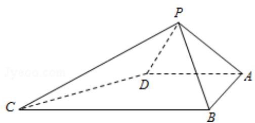

<!-- question-source:start -->
19. （12分）如图，四棱锥P-ABCD中， $\angle ABC = \angle BAD = 90^{\circ}$ ，BC=2AD， $\triangle PAB$ 与 $\triangle PAD$ 都是等边三角形.

(Ⅰ) 证明: PB⊥CD;

（II）求二面角 A - PD - C 的大小.

局比赛结束时，负的一方在下一局当裁判，设各局中双方获胜的概率均为 $\frac{1}{2}$ ，

各局比赛的结果都相互独立，第1局甲当裁判.

（Ⅰ）求第4局甲当裁判的概率；

（Ⅱ）x 表示前 4 局中乙当裁判的次数，求 x 的数学期望.
<!-- question-source:end -->

![[高中/真题/按年份分类/2013/2013年全国统一高考数学试卷_理科__大纲版__含解析版_/解答题/题目/answers/Q00026951A1.md]]
