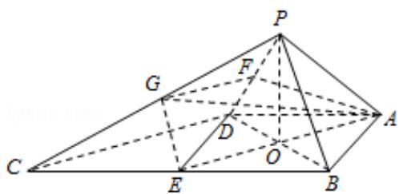

> [!faq]- 2013年全国统一高考数学试卷（理科）（大纲版）（含解析版）解析
>
> > [!success]- **【答案】** 详见解析
>
> > [!note]- **【分析】**
> > （I）取 BC 的中点 E，连接 DE，过点 P 作 PO⊥平面 ABCD 于 O，连接
>
> > [!note]- **【解析】**
> > 解：（I）取 BC 的中点 E，连接 DE，可得四边形 ABED 是正方形
> >
> > 过点 P 作 PO⊥平面 ABCD，垂足为 O，连接 OA、OB、OD、OE
> >
> > ∵△PAB 与△PAD 都是等边三角形，∴PA=PB=PD，可得 OA=OB=OD
> >
> > 因此，O 是正方形 ABED 的对角线的交点，可得 OE⊥OB
> >
> > ∵PO⊥平面ABCD，得直线OB是直线PB在内的射影，∴OE⊥PB
> >
> > ∵△BCD 中，E、O 分别为 BC、BD 的中点，∴OE∥CD，可得 PB⊥CD；
> >
> > (Ⅱ) 由 (Ⅰ) 知 CD⊥PO, CD⊥PB
> >
> > ∵PO、PB 是平面 PBD 内的相交直线，∴CD⊥平面 PBD
> >
> > ∵PDC平面PBD，∴CD⊥PD
> >
> > 取 PD 的中点 F，PC 的中点 G，连接 FG，
> >
> > 则 FG 为△PCD 有中位线，∴ FG∥CD，可得 FG⊥PD
> >
> > 连接 AF，由 $\triangle PAD$ 是等边三角形可得 AF⊥PD，∴ $\angle AFG$ 为二面角 A-PD-C 的平
> >
> > 面角
> >
> > 连接 AG、EG，则 EG||PB
> >
> > ∵PB⊥OE，∴EG⊥OE，
> >
> > 设 AB=2，则 $AE=2\sqrt{2}$ ， $EG=\frac{1}{2}PB=1$ ，故 $AG=\sqrt{AE^{2}+EG^{2}}=3$
> >
> > 在 $\triangle AFG$ 中， $FG = \frac{1}{2} CD = \sqrt{2}$ ， $AF = \sqrt{3}$ ， $AG = 3$
> >
> > $\therefore \cos \angle AFG = \frac{2 + 3 - 9}{2\times\sqrt{2}\times\sqrt{3}} = -\frac{\sqrt{6}}{3}$ 得 $\angle AFG = \pi -\arccos \frac{\sqrt{6}}{3},$
> >
> > 即二面角 A - PD - C 的平面角大小是 $\pi - \arccos \frac{\sqrt{6}}{3}$ .
> >
> > 
> >
> > 【点评】本题给出特殊的四棱锥，求证直线与直线垂直并求二面角平面角的大小，
> >
> > 着重考查了线面垂直的判定与性质、三垂线定理和运用余弦定理求二面的大
> >
> > 小等知识，属于中档题.
