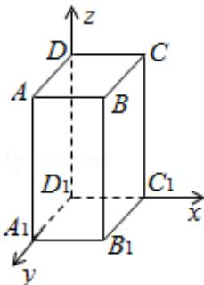

> [!faq]- 2013年全国统一高考数学试卷（理科）（大纲版）（含解析版）解析
>
> > [!success]- **【答案】** A
>
> > [!note]- **【分析】**
> > 设 AB=1，则 $AA_{1}=2$ ，分别以 $\overrightarrow{D_{1}A_{1}}$ 、 $\overrightarrow{D_{1}C_{1}}$ 、 $\overrightarrow{D_{1}D}$ 的方向为 x 轴、y 轴、z 轴的
>
> > [!note]- **【解析】**
> > 分析】设 AB=1，则 $AA_{1}=2$ ，分别以 $\overrightarrow{D_{1}A_{1}}$ 、 $\overrightarrow{D_{1}C_{1}}$ 、 $\overrightarrow{D_{1}D}$ 的方向为 x 轴、y 轴、z 轴的
> >
> > 正方向建立空间直角坐标系，设 $\vec{\mathrm{n}} = (x, y, z)$ 为平面 $\mathrm{BDC}_1$ 的一个法向量，CD与
> >
> > 平面 $BDC_{1}$ 所成角为 $\theta$ ，
> >
> > 则 $\sin \theta = \left|\frac{\overrightarrow{n} \cdot \overrightarrow{DC}}{|\overrightarrow{n}| |\overrightarrow{DC}|}\right|$ ，在空间坐标系下求出向量坐标，代入计算即可.
> >
> > 【
> > 解答】解：设 AB=1，则 $AA_{1}=2$ ，分别以 $\overrightarrow{D_{1}A_{1}}$ 、 $\overrightarrow{D_{1}C_{1}}$ 、 $\overrightarrow{D_{1}D}$ 的方向为 x 轴、y 轴、z
> >
> > 轴的正方向建立空间直角坐标系，
> >
> > 如下图所示:
> >
> > 
> >
> > 则 D（0，0，2）， $C_{1}$ （1，0，0），B（1，1，2），C（1，0，2），
> >
> > $\overrightarrow{\mathrm{DB}} = (1, 1, 0), \overrightarrow{\mathrm{DC}_1} = (1, 0, -2), \overrightarrow{\mathrm{DC}} = (1, 0, 0)$
> >
> > 设 $\vec{\mathbf{n}} = (x, y, z)$ 为平面 $BDC_{1}$ 的一个法向量，则 $\left\{ \begin{array}{l} \vec{n} \cdot \overrightarrow{DB} = 0 \\ \vec{n} \cdot \overrightarrow{DC_{1}} = 0 \end{array} \right.$ ，即 $\left\{ \begin{array}{l} x + y = 0 \\ x - 2z = 0 \end{array} \right.$ ，取 $\vec{\mathbf{n}} = (2, -$
> >
> > 2，1），
> >
> > 设 CD 与平面 BDC₁ 所成角为 θ，则 $\sin\theta=\left|\frac{\overrightarrow{n}\cdot\overrightarrow{DC}}{\left|\overrightarrow{n}\right|\left|\overrightarrow{DC}\right|}\right|=\frac{2}{3}$ ,
> >
> > 故选：A.
> >
> > 【点评】本题考查直线与平面所成的角，考查空间向量的运算及应用，准确理解线
> >
> > 面角与直线方向向量、平面法向量夹角关系是解决问题的关键.
