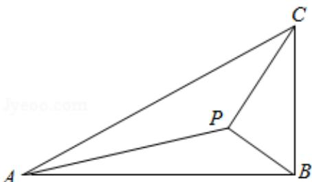

<!-- question-source:start -->
17. (12 分) 如图, 在 $\triangle ABC$ 中, $\angle ABC = 90^{\circ}$ , $AB = \sqrt{3}$ , $BC = 1$ , $P$ 为 $\triangle ABC$ 内一点, $\angle BPC = 90^{\circ}$ .

(1) 若 $PB=\frac{1}{2}$ ，求 PA;

(2) 若 $\angle APB = 150^{\circ}$ , 求 $\tan \angle PBA$ .

<!-- question-source:end -->

![[高中/真题/按年份分类/2013/2013年全国统一高考数学试卷_理科__新课标ⅰ__含解析版_/解答题/题目/answers/Q00024422A1.md]]
