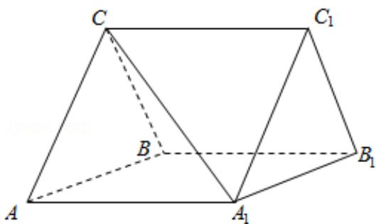

<!-- question-source:start -->
18. （12分）如图，三棱柱 $ABC-A_{1}B_{1}C_{1}$ 中，CA=CB， $AB=AA_{1}$ ， $\angle BAA_{1}=60^{\circ}$ .

（Ⅰ）证明 $AB \perp A_{1}C;$

（II）若平面 ABC⊥平面 AA₁B₁B，AB=CB=2，求直线 A₁C 与平面 BB₁C₁C 所成角的正

弦值.

<!-- question-source:end -->

![[高中/真题/按年份分类/2013/2013年全国统一高考数学试卷_理科__新课标ⅰ__含解析版_/解答题/题目/answers/Q00024423A1.md]]
