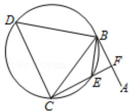

<!-- question-source:start -->
22. （10 分）（选修 4 - 1：几何证明选讲）

如图, 直线 $AB$ 为圆的切线, 切点为 $B$ , 点 $C$ 在圆上, $\angle ABC$ 的角平分线 $BE$ 交圆于

点 E，DB 垂直 BE 交圆于 D.

(Ⅰ) 证明: DB=DC;

（II）设圆的半径为1， $BC=\sqrt{3}$ ，延长CE交AB于点F，求△BCF外接圆的半径.

<!-- question-source:end -->

![[高中/真题/按年份分类/2013/2013年全国统一高考数学试卷_理科__新课标ⅰ__含解析版_/解答题/题目/answers/Q00024427A1.md]]
