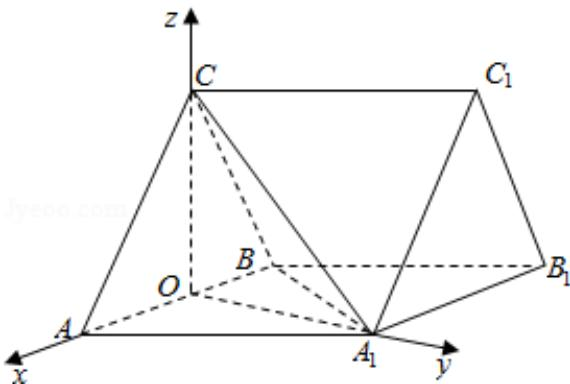

> [!faq]- 2013年全国统一高考数学试卷（理科）（新课标ⅰ）（含解析版）解析
>
> > [!success]- **【答案】** 详见解析
>
> > [!note]- **【分析】**
> > （Ⅰ）取 AB 的中点 O，连接 OC， $OA_{1}$ ， $A_{1}B$ ，由已知可证 $OA_{1} \perp AB$ ， $AB \perp$ 平面
>
> > [!note]- **【解析】**
> > 解：（Ⅰ）取 AB 的中点 O，连接 OC， $OA_{1}$ ， $A_{1}B$ ，
> >
> > 因为 CA=CB，所以 OC⊥AB，由于 AB=AA₁，∠BAA₁=60°，
> >
> > 所以 $\triangle AA_{1}B$ 为等边三角形，所以 $OA_{1}\perp AB$ ，
> >
> > 又因为 $OC \cap OA_{1} = O$ ，所以 AB ⊥ 平面 $OA_{1}C$ ，
> >
> > 又 $A_{1}C \subset$ 平面 $OA_{1}C$ ，故 $AB \perp A_{1}C$ ;
> >
> > （Ⅱ）由（Ⅰ）知 OC⊥AB，OA₁⊥AB，又平面 ABC⊥平面 AA₁B₁B，交线为 AB，
> >
> > 所以 OC⊥平面 $AA_{1}B_{1}B$ ，故 OA， $OA_{1}$ ，OC 两两垂直.
> >
> > 以O为坐标原点， $\overrightarrow{\mathrm{OA}}$ 的方向为x轴的正向， $|\overrightarrow{\mathrm{OA}}|$ 为单位长，建立如图所示的坐标
> >
> > 系，
> >
> > 可得 A（1，0，0），A₁（0，√3，0），C（0，0，√3），B（-1，0，0），则 $\overrightarrow{BC} = (1, 0, \sqrt{3})$ ， $\overrightarrow{BB_{1}} = \overrightarrow{AA_{1}} = (-1, \sqrt{3}, 0)$ ， $\overrightarrow{A_{1}C} = (0, -\sqrt{3}, \sqrt{3})$ ，设 $\vec{n} = (x, y, z)$ 为平面 BB₁C₁C 的法向量，则 $\left\{\begin{aligned}\vec{n} & \cdot \overrightarrow{BC} = 0 \\ \vec{n} & \cdot \overrightarrow{BB_{1}} = 0\end{aligned}\right.$ ，即 $\left\{\begin{aligned}x + \sqrt{3}z &= 0 \\ -x + \sqrt{3}y &= 0\end{aligned}\right.$ ，可取 y=1，可得 $\vec{n} = (\sqrt{3}, 1, -1)$ ，故 $\cos <\vec{n}$ ， $\overrightarrow{A_{1}C} > = \frac{\vec{n} \cdot \overrightarrow{A_{1}C}}{|\vec{n}| |\overrightarrow{A_{1}C}|} = -\frac{\sqrt{10}}{5}$ ，又因为直线与法向量的余弦值的绝对值等于直线与平面的正弦值，故直线 A₁C 与平面 BB₁C₁C 所成角的正弦值为： $\frac{\sqrt{10}}{5}$ .
> >
> > 
> >
> > 【点评】本题考查直线与平面所成的角，涉及直线与平面垂直的性质和平面与平
> > 面垂直的判定，属难题.
