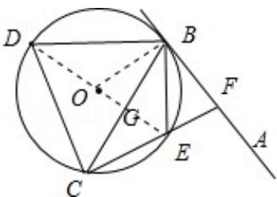

> [!faq]- 2013年全国统一高考数学试卷（理科）（新课标ⅰ）（含解析版）解析
>
> > [!success]- **【答案】** 详见解析
>
> > [!note]- **【分析】**
> > (I) 连接 DE 交 BC 于点 G，由弦切角定理可得 $\angle ABE = \angle BCE$ ，由已知角平分
>
> > [!note]- **【解析】**
> > （I）证明：连接 DE 交 BC 于点 G.
> >
> > 由弦切角定理可得 $\angle ABE = \angle BCE$ ，而 $\angle ABE = \angle CBE$ ，
> >
> > $\therefore \angle CBE = \angle BCE, BE = CE.$
> >
> > 又∵DB⊥BE，∴DE为⊙O的直径，∠DCE=90°.
> >
> > $\therefore \triangle DBE \cong \triangle DCE, \therefore DC = DB.$
> >
> > (Ⅱ) 由 (Ⅰ) 可知: $\angle CDE = \angle BDE$ , $DB = DC$ .
> >
> > 故 DG 是 BC 的垂直平分线，∴ $BG=\frac{\sqrt{3}}{2}$ .
> >
> > 设 DE 的中点为 O，连接 BO，则 $\angle BOG=60^{\circ}$ .
> >
> > 从而 $\angle ABE=\angle BCE=\angle CBE=30^{\circ}$ .
> >
> > $\therefore CF \perp BF.$
> >
> > $\therefore \mathrm{Rt}\triangle \mathrm{BCF}$ 的外接圆的半径 $= \frac{\sqrt{3}}{2}$
> >
> > 
> >
> > 【点评】本题综合考查了圆的性质、弦切角定理、等边三角形的性质、三角形全等、三角形的外接圆的半径等知识, 需要较强的推理能力、
