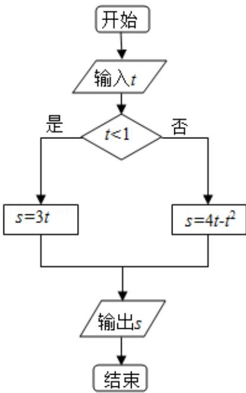

<!-- question-source:start -->
5. （5分）执行程序框图，如果输入的 $t \in [-1, 3]$ ，则输出的 $s$ 属于（）

A. $[-3, 4]$ B. $[-5, 2]$ C. $[-4, 3]$ D. $[-2, 5]$
<!-- question-source:end -->

![[高中/真题/按年份分类/2013/2013年全国统一高考数学试卷_理科__新课标ⅰ__含解析版_/选择题/题目/answers/Q00024410A1.md]]
