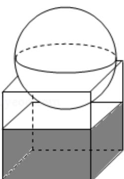

<!-- question-source:start -->
6. (5 分) 如图, 有一个水平放置的透明无盖的正方体容器, 容器高 $8 \mathrm{~cm}$ , 将一个球放在容器口, 再向容器注水, 当球面恰好接触水面时测得水深为 $6 \mathrm{~cm}$ , 如不计容器的厚度, 则球的体积为 ( )

A. $\frac{500\pi}{3}\mathrm{cm}^3$ B. $\frac{866\pi}{3}\mathrm{cm}^3$ C. $\frac{1372\pi}{3}\mathrm{cm}^3$ D. $\frac{2048\pi}{3}\mathrm{cm}^3$
<!-- question-source:end -->

![[高中/真题/按年份分类/2013/2013年全国统一高考数学试卷_理科__新课标ⅰ__含解析版_/选择题/题目/answers/Q00024411A1.md]]
