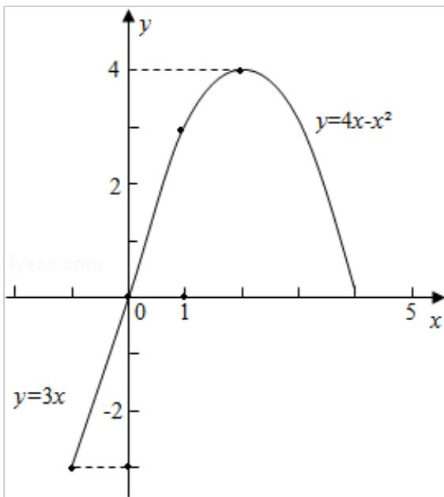

> [!faq]- 2013年全国统一高考数学试卷（理科）（新课标ⅰ）（含解析版）解析
>
> > [!success]- **【答案】** A
>
> > [!note]- **【分析】**
> > 本题考查的知识点是程序框图，分析程序中各变量、各语句的作用，再根
>
> > [!note]- **【解析】**
> > 解：由判断框中的条件为 $t < 1$ ，可得：
> >
> > 函数分为两段，即 t<1 与 $t \geq 1$ ，
> >
> > 又由满足条件时函数的解析式为：s=3t；
> >
> > 不满足条件时，即 $t \geq 1$ 时，函数的解析式为： $s = 4t - t^{2}$
> >
> > 故分段函数的解析式为： $s=\left\{\begin{aligned}&3t,&t<1\\ &4t-t^{2},&t\geqslant1\end{aligned}\right.$
> >
> > 如果输入的 $t \in [-1, 3]$ ，画出此分段函数在 $t \in [-1, 3]$ 时的图象，
> >
> > 则输出的 s 属于 $[-3, 4]$ .
> >
> > 故选：A.
> >
> > 
> >
> > 【点评】要求条件结构对应的函数解析式, 要分如下几个步骤: ①分析流程图的结
> > 构, 分析条件结构是如何嵌套的, 以确定函数所分的段数; ②根据判断框中的
> > 条件, 设置分类标准; ③根据判断框的“是”与“否”分支对应的操作, 分析
> > 函数各段的解析式; ④对前面的分类进行总结, 写出分段函数的解析式.
