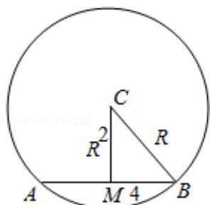

> [!faq]- 2013年全国统一高考数学试卷（理科）（新课标ⅰ）（含解析版）解析
>
> > [!success]- **【答案】** A
>
> > [!note]- **【分析】**
> > 设正方体上底面所在平面截球得小圆 M，可得圆心 M 为正方体上底面正方形的中心．设球的半径为 R，根据题意得球心到上底面的距离等于（R - 2）cm，而圆 M 的半径为 4，由球的截面圆性质建立关于 R 的方程并解出 R=5，用球的体积公式即可算出该球的体积.
>
> > [!note]- **【解析】**
> > 解：设正方体上底面所在平面截球得小圆 M，
> >
> > 则圆心 M 为正方体上底面正方形的中心．如图．
> >
> > 设球的半径为 R，根据题意得球心到上底面的距离等于 $(R - 2)$ cm，
> >
> > 而圆 M 的半径为 4，由球的截面圆性质，得 $R^{2}=(R-2)^{2}+4^{2}$
> >
> > 解出 R=5，
> >
> > ∴根据球的体积公式，该球的体积 $V=\frac{4\pi}{3}R^{3}=\frac{4\pi}{3}\times5^{3}=\frac{500\pi}{3}cm^{3}$
> >
> > 故选：A.
> >
> > 
