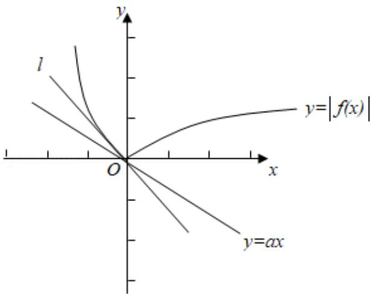

> [!faq]- 2013年全国统一高考数学试卷（理科）（新课标ⅰ）（含解析版）解析
>
> > [!success]- **【答案】** D
>
> > [!note]- **【分析】**
> > 由函数图象的变换, 结合基本初等函数的图象可作出函数 $y=|f(x)|$ 的图
>
> > [!note]- **【解析】**
> > 解：由题意可作出函数 $y=|f(x)|$ 的图象，和函数 y=ax 的图象，由图象可知：函数 $y = ax$ 的图象为过原点的直线，当直线介于 1 和 $x$ 轴之间符合题意，直线 1 为曲线的切线，且此时函数 $y = |f(x)|$ 在第二象限的部分解析式为 $y = x^2 - 2x$ ，
> >
> > 
> >
> > 求其导数可得 $y' = 2x - 2$ ，因为 $x \leq 0$ ，故 $y' \leq -2$ ，故直线 l 的斜率为 -2，
> >
> > 故只需直线 y=ax 的斜率 a 介于 -2 与 0 之间即可，即 $a \in [-2, 0]$
> >
> > 故选：D.
