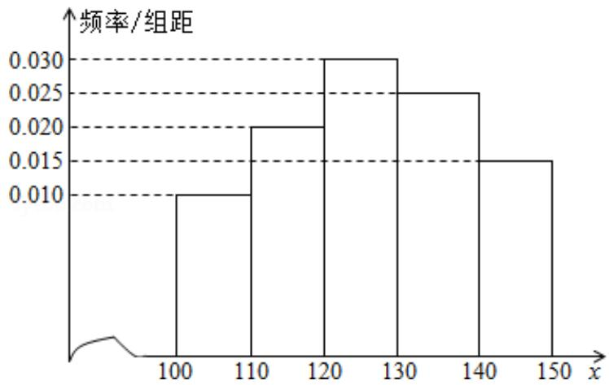
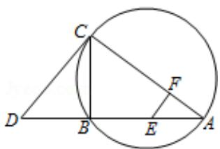

# 2013年全国统一高考数学试卷（理科）（新课标Ⅱ）

##
一、选择题：本大题共12小题.每小题5分，共60分.在每个小题给出的四个选

项中，只有一项是符合题目要求的。

1. （5分）已知集合 $M = \{x \mid (x - 1)^2 < 4, x \in \mathbb{R}\}$ ， $N = \{-1, 0, 1, 2, 3\}$ ，则 $M \cap N = (\quad)$ A. $\{0, 1, 2\}$ B. $\{-1, 0, 1, 2\}$

C. $\{-1, 0, 2, 3\}$ D. $\{0, 1, 2, 3\}$

2. （5分）设复数 $z$ 满足（1-i） $z = 2i$ ，则 $z = (\quad)$ A. $-1 + i$ B. $-1 - i$ C. $1 + i$ D. $1 - i$

3. (5分)等比数列 $\{a_{n}\}$ 的前 $n$ 项和为 $S_{n}$ , 已知 $S_{3} = a_{2} + 10a_{1}, a_{5} = 9$ , 则 $a_{1} = (\quad)$ A. $\frac{1}{3}$ B. $-\frac{1}{3}$ C. $\frac{1}{9}$ D. $-\frac{1}{9}$

4. （5分）已知 m，n 为异面直线，m⊥平面 α，n⊥平面 β．直线 l 满足
l⊥m, l⊥n, l∉α, l∉β，则（）
A. α∥β 且 l∥α    B. α⊥β 且 l⊥β
C. α 与 β 相交，且交线垂直于 l    D. α 与 β 相交，且交线平行于 l

5. （5分）已知（1+ax）（1+x） $^{5}$ 的展开式中 $x^{2}$ 的系数为5，则a=（）

6. （5分）执行右面的程序框图，如果输入的N=10，那么输出的S=（）
A. $1+\frac{1}{2}+\frac{1}{3}+\cdots+\frac{1}{10}$ B. $1+\frac{1}{2!}+\frac{1}{3!}+\cdots+\frac{1}{10!}$ C. $1+\frac{1}{2}+\frac{1}{3}+\cdots+\frac{1}{11}$ D. $1+\frac{1}{2!}+\frac{1}{3!}+\cdots+\frac{1}{11!}$

7. （5 分）一个四面体的顶点在空间直角坐标系 O - xyz 中的坐标分别是
(1,0,1), (1,1,0), (0,1,1), (0,0,0), 画该四面体三视图中的正视图时,

以 zOx 平面为投影面，则得到正视图可以为（）

A.

B.

C.

D.  

8. （5分）设 $a = \log_36$ ， $b = \log_510$ ， $c = \log_714$ ，则（ ）A. $c > b > a$ B. $b > c > a$ C. $a > c > b$ D. $a > b > c$

9. (5 分) 已知 $a > 0$ , 实数 $x, y$ 满足: $\left\{ \begin{array}{l} x \geqslant 1 \\ x + y \leqslant 3 \\ y \geqslant a(x - 3) \end{array} \right.$ , 若 $z = 2x + y$ 的最小值为 1, 则 $a = ($ A. 2 B. 1 C. $\frac{1}{2}$ D. $\frac{1}{4}$

10. （5分）已知函数 $f(x) = x^3 + ax^2 + bx + c$ ，下列结论中错误的是（）
A. $\exists x_0 \in R, f(x_0) = 0$ B. 函数 $y = f(x)$ 的图象是中心对称图形
C. 若 $x_0$ 是 $f(x)$ 的极小值点，则 $f(x)$ 在区间 $(- \infty, x_0)$ 单调递减
D. 若 $x_0$ 是 $f(x)$ 的极值点，则 $f'(x_0) = 0$

11. (5 分) 设抛物线 C: $y^{2}=2px$ (p>0) 的焦点为 F，点 M 在 C 上， $|MF|=5$ ，若以 MF 为直径的圆过点（0，2），则 C 的方程为（）

A. $y^{2}=4x$ 或 $y^{2}=8x$ B. $y^{2}=2x$ 或 $y^{2}=8x$ C. $y^{2}=4x$ 或 $y^{2}=16x$ D. $y^{2}=2x$ 或 $y^{2}=16x$

12. (5 分) 已知点 A(-1,0), B(1,0), C(0,1), 直线 $y=ax+b$ (a>0) 将 $\triangle ABC$ 分割为面积相等的两部分，则 b 的取值范围是（）

A. (0, 1) B. $(1\frac{\sqrt{2}}{2}, \frac{1}{2})$ C. $(1\frac{\sqrt{2}}{2}, \frac{1}{3}]$ D. $[\frac{1}{3}, \frac{1}{2})$

##
二、填空题：本大题共4小题，每小题5分.

13.（5分）已知正方形ABCD的边长为2，E为CD的中点，则 $\overrightarrow{AE} \cdot \overrightarrow{BD} =$

14. (5 分) 从 n 个正整数 1, 2, …, n 中任意取出两个不同的数, 若取出的两数之和等于 5 的概率为 $\frac{1}{14}$ , 则 $n=$ \_\_\_\_.

15. (5分) 设 $\theta$ 为第二象限角, 若 $\tan \left(\theta + \frac{\pi}{4}\right) = \frac{1}{2}$ , 则 $\sin \theta + \cos \theta =$ \_\_\_\_.

16. (5 分) 等差数列 $\{a_{n}\}$ 的前 $n$ 项和为 $S_{n}$ , 已知 $S_{10} = 0, S_{15} = 25$ , 则 $nS_{n}$ 的最小值为

##
三．解答题：
解答应写出文字说明，证明过程或演算步骤：

17. (12 分) $\triangle ABC$ 在内角 A、B、C 的对边分别为 a, b, c，已知 $a = b\cos C + c\sin B$ 。

(Ⅰ) 求 B;

（II）若 b=2，求 $\triangle ABC$ 面积的最大值.

18. （12分）如图，直棱柱 $ABC-A_{1}B_{1}C_{1}$ 中，D，E分别是AB， $BB_{1}$ 的中点， $AA_{1}=AC=CB=\frac{\sqrt{2}}{2}AB.$

(Ⅰ) 证明: $BC_{1} \parallel$ 平面 $A_{1}CD$

（II）求二面角 $D - A_{1}C - E$ 的正弦值.

19.（12分）经销商经销某种农产品，在一个销售季度内，每售出1t该产品获利

润 500 元，未售出的产品，每 1t 亏损 300 元。根据历史资料，得到销售季度内

市场需求量的频率分布直方图，如图所示．经销商为下一个销售季度购进了

130t 该农产品．以 x（单位：t， $100 \leq x \leq 150$ ）表示下一个销售季度内的市场需

求量，T（单位：元）表示下一个销售季度内经销该农产品的利润.

  
（Ⅰ）将T表示为x的函数；

（Ⅱ）根据直方图估计利润 T 不少于 57000 元的概率；

(III) 在直方图的需求量分组中, 以各组的区间中点值代表该组的各个值, 并以需
求量落入该区间的频率作为需求量取该区间中点值的概率 (例如: 若 x∈[100,
110)) 则取 x=105, 且 x=105 的概率等于需求量落入 [100, 110) 的频率, 求 T 的
数学期望.

20. (12 分) 平面直角坐标系 xOy 中, 过椭圆 M: $\frac{x^{2}}{a^{2}} + \frac{y^{2}}{b^{2}} = 1 (a > b > 0)$ 右焦点的直线 $x + y - \sqrt{3} = 0$ 交 M 于 A, B 两点, P 为 AB 的中点, 且 OP 的斜率为 $\frac{1}{2}$ .

（I）求M的方程

(II) C, D 为 M 上的两点, 若四边形 ACBD 的对角线 CD⊥AB, 求四边形 ACBD 面积

的最大值.

21. (12 分) 已知函数 $f(x) = e^x - \ln (x + m)$

(Ⅰ) 设 x=0 是 f(x) 的极值点，求 m，并讨论 f(x) 的单调性；

（Ⅱ）当 $m \leq 2$ 时，证明 $f(x) > 0$ .

选考题：（第22题～第24题为选考题，考生根据要求作答．请考生在第

22、23、24题中任选择一题作答，如果多做，则按所做的第一部分评分，作答

时请写清题号）

22. （10 分）【选修 4 - 1 几何证明选讲】

如图，CD 为 $\triangle ABC$ 外接圆的切线，AB 的延长线交直线 CD 于点 D，E、F 分别为弦

AB 与弦 AC 上的点，且 BC•AE=DC•AF，B、E、F、C 四点共圆.

(1) 证明: CA 是 $\triangle ABC$ 外接圆的直径;

(2) 若 DB=BE=EA，求过 B、E、F、C 四点的圆的面积与 $\triangle ABC$ 外接圆面积的比值.

23. 已知动点 P、Q 都在曲线 C: $\left\{\begin{aligned} x &= 2\cos\beta \\ y &= 2\sin\beta \end{aligned}\right.$ ( $\beta$ 为参数) 上，对应参数分别为 $\beta = \alpha$

与 $\beta=2\alpha$ （ $0<\alpha<2\pi$ ），M 为 PQ 的中点.

(1) 求 M 的轨迹的参数方程;

(2) 将 $M$ 到坐标原点的距离 $d$ 表示为 $\alpha$ 的函数，并判断 $M$ 的轨迹是否过坐标原

点.

24. 【选修 4 -- 5；不等式选讲】

设 a, b, c 均为正数，且 $a + b + c = 1$ ，证明：

(1) $ab + bc + ca \leqslant \frac{1}{3}$

(II) $\frac{a^2}{b} + \frac{b^2}{c} + \frac{c^2}{a} \geqslant 1$ .

# 2013年全国统一高考数学试卷（理科）（新课标Ⅱ）

参考
答案与
试题
解析

##

![[高中/真题/按年份分类/2013/2013年全国统一高考数学试卷_理科__新课标ⅱ__含解析版_/选择题/选择题.md]]
![[高中/真题/按年份分类/2013/2013年全国统一高考数学试卷_理科__新课标ⅱ__含解析版_/填空题/填空题.md]]
![[高中/真题/按年份分类/2013/2013年全国统一高考数学试卷_理科__新课标ⅱ__含解析版_/解答题/解答题.md]]
