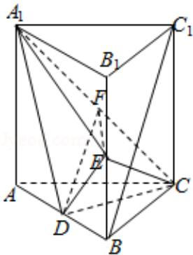

> [!faq]- 2013年全国统一高考数学试卷（理科）（新课标ⅱ）（含解析版）解析
>
> > [!success]- **【答案】** （12分）如图，直棱柱 $ABC-A_{1}B_{1}C_{1}$ 中，D，E分别是AB， $BB_{1}$ 的中点， $AA_{1}=AC=CB=\frac{\sqrt{2}}{2}AB
>
> > [!note]- **【分析】**
> > （Ⅰ）通过证明 $BC_{1}$ 平行平面 $A_{1}CD$ 内的直线 DF，利用直线与平面平行的
>
> > [!note]- **【解析】**
> > 解：（Ⅰ）证明：连结 $AC_{1}$ 交 $A_{1}C$ 于点 F，则 F 为 $AC_{1}$ 的中点，
> >
> > 又 D 是 AB 中点，连结 DF，则 $BC_{1} \parallel DF$ ，
> >
> > 因为 DFC 平面 $A_{1}CD$ ， $BC_{1} \not\subset$ 平面 $A_{1}CD$ ，
> >
> > 所以 $BC_{1}$ 平面 $A_{1}CD$ .
> >
> > （II）因为直棱柱 $ABC - A_{1}B_{1}C_{1}$ ，所以 $AA_{1} \perp CD$ ，
> >
> > 由已知 AC=CB，D 为 AB 的中点，所以 CD⊥AB，
> >
> > 又 $AA_{1} \cap AB = A$ ，于是，CD⊥平面 $ABB_{1}A_{1}$ ，
> >
> > 设 $AB=2\sqrt{2}$ ，则 $AA_{1}=AC=CB=2$ ，得 $\angle ACB=90^{\circ}$ ，
> >
> > $CD=\sqrt{2},\quad A_{1}D=\sqrt{6},\quad DE=\sqrt{3},\quad A_{1}E=3$
> >
> > 故 $A_{1}D^{2}+DE^{2}=A_{1}E^{2}$ ，即 $DE\perp A_{1}D$ ，所以 $DE\perp$ 平面 $A_{1}DC$ ，
> >
> > 又 $A_{1}C = 2\sqrt{2}$ ，过D作DF⊥ $A_{1}C$ 于F，∠DFE为二面角D-A $_{1}$ C-E的平面角，
> >
> > 在 $\triangle A_{1}DC$ 中， $DF = \frac{A_{1}D\cdot DC}{A_{1}C} = \frac{\sqrt{6}}{2}$ ， $EF = \sqrt{DE^2 + DF^2} = \frac{3\sqrt{2}}{2},$
> >
> > 所以二面角 $D - A_{1}C - E$ 的正弦值. $\sin \angle DFE = \frac{DE}{EF} = \frac{\sqrt{6}}{3}$ .
> >
> > 
