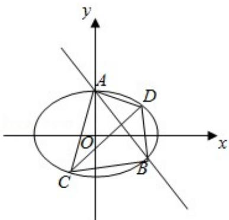

> [!faq]- 2013年全国统一高考数学试卷（理科）（新课标ⅱ）（含解析版）解析
>
> > [!success]- **【答案】** 详见解析
>
> > [!note]- **【分析】**
> > （Ⅰ）把右焦点 $(c,0)$ 代入直线可解得c.设 $A(x_{1},y_{1})$ ， $B(x_{2},y_{2})$ ，线段AB
>
> > [!note]- **【解析】**
> > 解：（Ⅰ）把右焦点 $(c,0)$ 代入直线 $x+y-\sqrt{3}=0$ 得 $c+0-\sqrt{3}=0$ ，解得 $c=\sqrt{3}$ .
> >
> > 设 A $(x_{1}, y_{1})$ ，B $(x_{2}, y_{2})$ ，线段 AB 的中点 P $(x_{0}, y_{0})$ ，
> >
> > 则 $\frac{\mathbf{x}_1^2}{\mathbf{a}^2} +\frac{\mathbf{y}_1^2}{\mathbf{b}^2} = 1$ ， $\frac{\mathbf{x}_2^2}{\mathbf{a}^2} +\frac{\mathbf{y}_2^2}{\mathbf{b}^2} = 1$ ，相减得 $\frac{\mathbf{x}_1^2 - \mathbf{x}_2^2}{\mathbf{a}^2} +\frac{\mathbf{y}_1^2 - \mathbf{y}_2^2}{\mathbf{b}^2} = 0,$
> >
> > $$
> > \therefore \frac {\mathrm{x} _ {1} + \mathrm{x} _ {2}}{\mathrm{a} ^ {2}} + \frac {\mathrm{y} _ {1} + \mathrm{y} _ {2}}{\mathrm{b} ^ {2}} \times \frac {\mathrm{y} _ {1} - \mathrm{y} _ {2}}{\mathrm{x} _ {1} - \mathrm{x} _ {2}} = 0,
> > $$
> >
> > $\therefore \frac{2x_0}{a^2} +\frac{2y_0}{b^2}\times (-1) = 0$ ，又 $\mathrm{k_{OP}} = \frac{1}{2} = \frac{y_0}{x_0},$
> >
> > $\therefore \frac{1}{a^2} - \frac{1}{2b^2} = 0$ ，即 $a^2 = 2b^2$ .
> >
> > 联立得 $\left\{ \begin{array}{l}a^{2} = 2b^{2}\\ a^{2} = b^{2} + c^{2}\\ c = \sqrt{3} \end{array} \right.$ ，解得 $\left\{ \begin{array}{l}b^2 = 3\\ a^2 = 6 \end{array} \right.,$
> >
> > ∴M的方程为 $\frac{x^{2}}{6}+\frac{y^{2}}{3}=1$ .
> >
> > (II) $\because CD \perp AB, \therefore$ 可设直线 $CD$ 的方程为 $y = x + t$ ,
> >
> > 联立 $\left\{\begin{aligned}y&=x+t\\ \frac{x^{2}}{6}&+\frac{y^{2}}{3}=1\end{aligned}\right.$ ，消去y得到 $3x^{2}+4tx+2t^{2}-6=0$ ，
> >
> > ∵直线 CD 与椭圆有两个不同的交点，
> >
> > $\therefore \triangle = 16t^{2} - 12(2t^{2} - 6) = 72 - 8t^{2} > 0$ ，解 $-3 < t < 3$ （\*）.
> >
> > 设 C $(x_{3}, y_{3})$ ，D $(x_{4}, y_{4})$ ，∴ $x_{3} + x_{4} = \frac{4t}{3}$ ， $x_{3}x_{4} = \frac{2t^{2} - 6}{3}$ .
> >
> > $$
> > \therefore | \mathrm{CD} | = \sqrt {(1 + 1 ^ {2}) [ (\mathbf {x} _ {3} + \mathbf {x} _ {4}) ^ {2} - 4 \mathbf {x} _ {3} \mathbf {x} _ {4} ]} = \sqrt {2 [ (- \frac {4 t}{3}) ^ {2} - 4 \times \frac {2 t ^ {2} - 6}{3} ]} =
> > $$
> >
> > $$
> > \frac {2 \sqrt {2} \cdot \sqrt {1 8 - 2 t ^ {2}}}{3}.
> > $$
> >
> > 联立 $\left\{ \begin{array}{l} x + y - \sqrt{3} = 0 \\ \frac{x^2}{6} + \frac{y^2}{3} = 1 \end{array} \right.$ 得到 $3x^{2} - 4\sqrt{3} x = 0$ ，解得 $x = 0$ 或 $\frac{4}{3}\sqrt{3}$
> >
> > ∴交点为 A $(0, \sqrt{3})$ ，B $\left(\frac{4}{3}\sqrt{3}, -\frac{\sqrt{3}}{3}\right)$ ，
> >
> > $$
> > \therefore | A B | = \sqrt {\left(\frac {4}{3} \sqrt {3} - 0\right) ^ {2} + \left(- \frac {\sqrt {3}}{3} - \sqrt {3}\right) ^ {2}} = \frac {4 \sqrt {6}}{3}.
> > $$
> >
> > $\therefore S_{四边形ACBD} = \frac{1}{2}|AB| \quad |CD| = \frac{1}{2} \times \frac{4\sqrt{6}}{3} \times \frac{2\sqrt{2} \cdot \sqrt{18 - 2t^2}}{3} = \frac{8\sqrt{3} \cdot \sqrt{18 - 2t^2}}{9},$
> >
> > ∴当且仅当 t=0 时，四边形 ACBD 面积的最大值为 $\frac{8}{3}\sqrt{6}$ ，满足（\*）.
> > ∴四边形 ACBD 面积的最大值为 $\frac{8}{3}\sqrt{6}$ .
> >
> > 
> >
> > 【点评】本题综合考查了椭圆的定义、标准方程及其性质、“点差法”、中点坐标公式、直线与椭圆相交问题转化为方程联立得到一元二次方程根与系数的关系、弦长公式、四边形的面积计算、二次函数的单调性等基础知识，考查了推
> >
> > 理能力、数形结合的思想方法、计算能力、分析问题和解决问题的能力。
