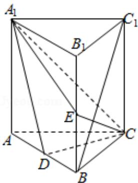

<!-- question-source:start -->
18. （12分）如图，直棱柱 $ABC-A_{1}B_{1}C_{1}$ 中，D，E分别是AB， $BB_{1}$ 的中点， $AA_{1}=AC=CB=\frac{\sqrt{2}}{2}AB.$

(Ⅰ) 证明: $BC_{1} \parallel$ 平面 $A_{1}CD$

（II）求二面角 $D - A_{1}C - E$ 的正弦值.

【考点】LS：直线与平面平行；MJ：二面角的平面角及求法.

【专题】11：计算题；14：证明题；5G：空间角.

【
<!-- question-source:end -->

![[高中/真题/按年份分类/2013/2013年全国统一高考数学试卷_理科__新课标ⅱ__含解析版_/解答题/题目/answers/Q00028200A1.md]]
