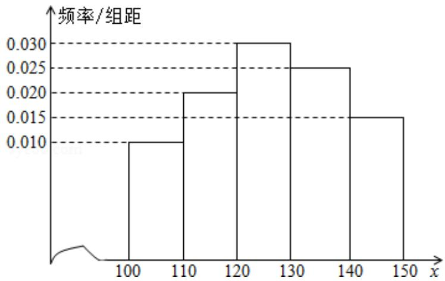

<!-- question-source:start -->
19.（12分）经销商经销某种农产品，在一个销售季度内，每售出1t该产品获利

润 500 元，未售出的产品，每 1t 亏损 300 元。根据历史资料，得到销售季度内

市场需求量的频率分布直方图，如图所示．经销商为下一个销售季度购进了

130t 该农产品．以 x（单位：t， $100 \leq x \leq 150$ ）表示下一个销售季度内的市场需

求量，T（单位：元）表示下一个销售季度内经销该农产品的利润.

（Ⅰ）将T表示为x的函数；

（Ⅱ）根据直方图估计利润 T 不少于 57000 元的概率；

(III) 在直方图的需求量分组中, 以各组的区间中点值代表该组的各个值, 并以需

求量落入该区间的频率作为需求量取该区间中点值的概率（例如：若 $x \in [100,$

110) 则取 $x = 105$ ，且 $x = 105$ 的概率等于需求量落入[100, 110)的频率，求T的

数学期望.

【考点】B8: 频率分布直方图; BE: 用样本的数字特征估计总体的数字特征; CH: 离

散型随机变量的期望与方差.

【专题】51：概率与统计.

【
<!-- question-source:end -->

![[高中/真题/按年份分类/2013/2013年全国统一高考数学试卷_理科__新课标ⅱ__含解析版_/解答题/题目/answers/Q00028201A1.md]]
