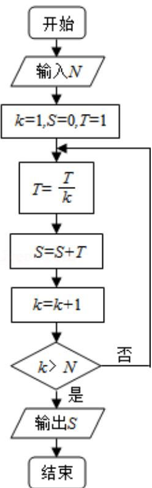

<!-- question-source:start -->
6. （5 分）执行右面的程序框图，如果输入的 N=10，那么输出的 S=（）

A. $1+\frac{1}{2}+\frac{1}{3}+\cdots+\frac{1}{10}$

B. $1+\frac{1}{2!}+\frac{1}{3!}+\cdots+\frac{1}{10!}$

c. $1+\frac{1}{2}+\frac{1}{3}+\cdots+\frac{1}{11}$

D. $1+\frac{1}{2!}+\frac{1}{3!}+\cdots+\frac{1}{11!}$

【考点】EF：程序框图.

【专题】27：图表型.

【
<!-- question-source:end -->

![[高中/真题/按年份分类/2013/2013年全国统一高考数学试卷_理科__新课标ⅱ__含解析版_/选择题/题目/answers/Q00028188A1.md]]
