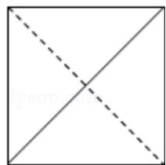
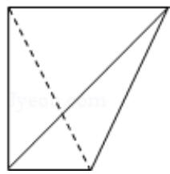
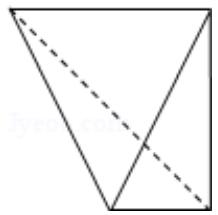
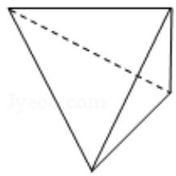

<!-- question-source:start -->
7. （5分）一个四面体的顶点在空间直角坐标系 O - xyz 中的坐标分别是
(1,0,1), (1,1,0), (0,1,1), (0,0,0), 画该四面体三视图中的正视图时,
以 zOx 平面为投影面，则得到正视图可以为（）

A.

B.

C.

D.

【考点】L7：简单空间图形的三视图.

【专题】11：计算题；13：作图题.

【
<!-- question-source:end -->

![[高中/真题/按年份分类/2013/2013年全国统一高考数学试卷_理科__新课标ⅱ__含解析版_/选择题/题目/answers/Q00028189A1.md]]
