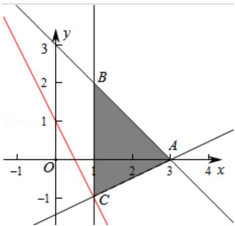

> [!faq]- 2013年全国统一高考数学试卷（理科）（新课标ⅱ）（含解析版）解析
>
> > [!success]- **【答案】** C
>
> > [!note]- **【分析】**
> > 作出不等式对应的平面区域, 利用线性规划的知识, 通过平移即先确定 z
>
> > [!note]- **【解析】**
> > 解：作出不等式对应的平面区域，（阴影部分）
> >
> > 由 $z=2x+y$ ，得 $y=-2x+z$ ，
> >
> > 平移直线 $y = -2x + z$ ，由图象可知当直线 $y = -2x + z$ 经过点 $C$ 时，直线 $y = -2x + z$ 的
> >
> > 截距最小，此时 z 最小.
> >
> > 即 $2x+y=1$ ，
> >
> > 由 $\left\{\begin{aligned}x=1\\ 2x+y=1\end{aligned}\right.$ ，解得 $\left\{\begin{aligned}x=1\\ y=-1\end{aligned}\right.$
> >
> > 即 C（1，-1），
> >
> > ∵点 C 也在直线 y=a (x-3) 上，
> >
> > $$
> > \therefore - 1 = - 2 a,
> > $$
> >
> > 解得 $a=\frac{1}{2}$ .
> >
> > 故选：C.
> >
> > 
> >
> > 【点评】本题主要考查线性规划的应用，利用数形结合是解决线性规划题目的常
> > 用方法.
