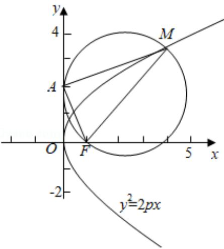

> [!faq]- 2013年全国统一高考数学试卷（理科）（新课标ⅱ）（含解析版）解析
>
> > [!success]- **【答案】** C
>
> > [!note]- **【分析】**
> > 根据抛物线方程算出 $|\mathrm{OF}| = \frac{\mathrm{p}}{2}$ ，设以MF为直径的圆过点A（0，2），在
>
> > [!note]- **【解析】**
> > 解：∵抛物线 C 方程为 $y^{2}=2px$ （p>0），
> >
> > ∴焦点 F 坐标为 $\left(\frac{p}{2}, 0\right)$ ，可得 $|OF| = \frac{p}{2}$ ,
> >
> > ∵以 MF 为直径的圆过点（0，2），
> >
> > ∴设 A（0，2），可得 AF⊥AM，
> >
> > Rt△AOF中， $|AF|=\sqrt{2^{2}+\left(\frac{p}{2}\right)^{2}}=\sqrt{4+\frac{p^{2}}{4}}$
> >
> > $$
> > \therefore \sin \angle O A F = \frac {| O F |}{| A F |} = \frac {\frac {p}{2}}{\sqrt {4 + \frac {p ^ {2}}{4}}},
> > $$
> >
> > $\because$ 根据抛物线的定义，得直线 AO 切以 MF 为直径的圆于 A 点， $\therefore \angle OAF = \angle AMF$ ，可得 Rt $\triangle AMF$ 中， $\sin \angle AMF = \frac{|AF|}{|MF|} = \frac{\frac{p}{2}}{\sqrt{4 + \frac{p^2}{4}}}$ ， $\because |MF| = 5, |AF| = \sqrt{4 + \frac{p^2}{4}}$ $\therefore \frac{\sqrt{4 + \frac{p^2}{4}}}{5} = \frac{\frac{p}{2}}{\sqrt{4 + \frac{p^2}{4}}}$ ，整理得 $4 + \frac{p^2}{4} = \frac{5p}{2}$ ，解之可得 $p = 2$ 或 $p = 8$ 因此，抛物线 C 的方程为 $y^2 = 4x$ 或 $y^2 = 16x$ .
> >
> > 故选：C.
> >
> > 方法二：
> >
> > ∵抛物线 C 方程为 $y^{2}=2px$ （p>0），∴焦点 F $\left(\frac{p}{2},0\right)$ ，
> >
> > 设 M（x，y），由抛物线性质 $\left|MF\right|=x+\frac{p}{2}=5$ ，可得 $x=5-\frac{p}{2}$
> >
> > 因为圆心是 MF 的中点, 所以根据中点坐标公式可得, 圆心横坐标为 $\frac{5-\frac{p}{2}+\frac{p}{2}}{2}=\frac{5}{2}$ ,
> >
> > 由已知圆半径也为 $\frac{5}{2}$ ，据此可知该圆与 $y$ 轴相切于点 $(0, 2)$ ，故圆心纵坐标为 $2$ ，
> >
> > 则 M 点纵坐标为 4，
> >
> > 即 M $(5 - \frac{p}{2}, 4)$ ，代入抛物线方程得 $p^{2} - 10p + 16 = 0$ ，所以 p = 2 或 p = 8。
> > 所以抛物线 C 的方程为 $y^{2}=4x$ 或 $y^{2}=16x$ .
> >
> > 故选：C.
> >
> > 
> >
> > 【点评】本题给出抛物线一条长度为 5 的焦半径 MF，以 MF 为直径的圆交抛物线于点 $(0, 2)$ ，求抛物线的方程，着重考查了抛物线的定义与简单几何性质、圆的性质和解直角三角形等知识，属于中档题.
